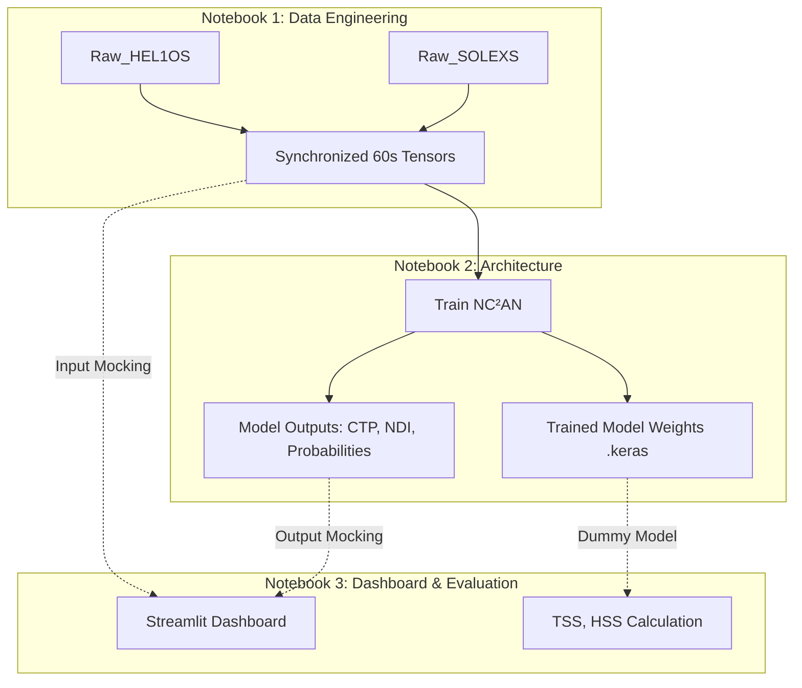

# NC²AN Notebook 3: Independence and Forensic Audit Report

## 1. Executive Summary
This report analyzes whether Notebook 3 (Evaluation, Explainability & Operational Dashboard) can be developed concurrently with Notebooks 1 (Data Engineering) and 2 (Architecture & Training).
**Conclusion**: Yes, Notebook 3 is highly decoupled and can be developed 100% independently by relying on established Interface Contracts and Mockable Components.

## 2. Dependency Graph

## 3. Required Inputs from Notebook 1
Notebook 1 provides the fundamental data streams feeding the dashboard. Notebook 3 requires:
- Synchronized time-series sliding windows of 60 timesteps (1Hz cadence).
- **HEL1OS tensor**: Mapping Broadband 1.8–90 keV data.
- **SOLEXS tensor**: Mapping Soft X-Ray counts.
- **Synchronization logic**: Guaranteeing a 0.5 second tolerance (handled upstream via `pandas.merge_asof`).

## 4. Required Outputs from Notebook 2
Notebook 2 provides the inference engine. Notebook 3 requires:
- The serialized model file (e.g., `nc2an_best.keras`) capable of accepting Notebook 1's output tensors.
- **Flare Probabilities**: Predictions for 1h, 6h, 12h, 24h horizons.
- **Cross-Attention Matrices**: For Causal Transfer Proxy (CTP) heatmap extraction.
- **Neupert Deviation Index (NDI)**: Real-time physics constraint violation metric array/stream.

## 5. Mockable Components
To unblock independent dashboard development, the following components can be fully mocked in Notebook 3:
- **Data Streams**: Generated via `tf.random.normal()` or `numpy.random.normal()` for HEL1OS `[Batch, 60, 1]` and SOLEXS `[Batch, 60, 4]`.
- **Inference Engine**: A mock `DummyNC2AN` class returning random tensors matching the final output specifications.
- **Evaluation Labels**: Random binary arrays to simulate quiet sun vs. flare periods to build the TSS and HSS evaluation calculation functions.

## 6. Components Requiring Real Model Outputs
While the UI/UX and metric calculation logic can be built entirely with mocks, the final operational integration will require real data for:
- **Calibrated Thresholds**: The optimal threshold for Precision-Recall and CUSUM triggering can only be determined with actual model inference over the validation set.
- **Physics Interpretability Validation**: Visualizing the CTP diagonal (Neupert delay) requires real learned attention weights; mocked attention generates pure noise.
- **Real NDI distribution**: To set the true "NDI Critical Alert" threshold dynamically.

## 7. Parallel Development Feasibility
**Feasibility Score: 10/10**
The dashboard developer can construct the entire Streamlit application, plotting functions (Plotly/Seaborn), and metric calculations immediately. By adhering to the handoff specification (Deliverable 2), the integration phase will consist solely of swapping the `DummyNC2AN` class with `tf.keras.models.load_model()` and feeding it real `tf.data` streams.
