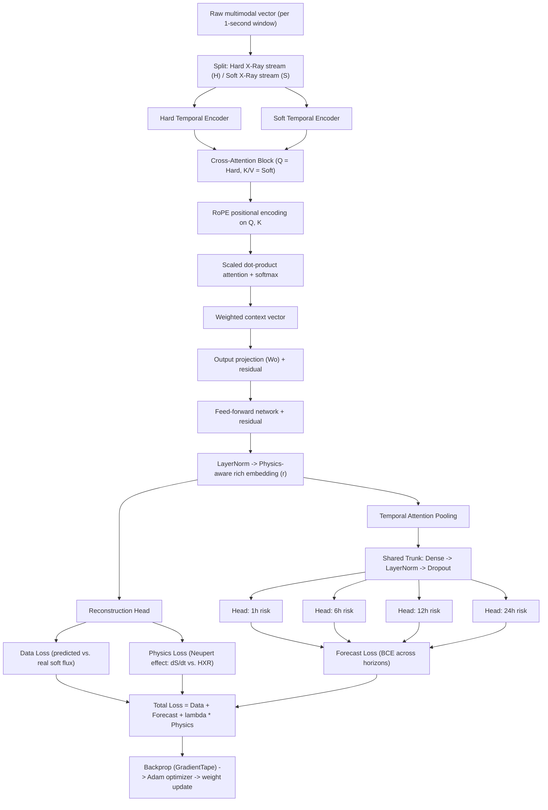

# 🌞 NeupertNet — Physics-Informed Cross-Attention Network for Solar Flare Forecasting

A multimodal deep learning architecture that fuses **Hard X-Ray (HXR)** and **Soft X-Ray (SXR)** solar emission time-series through cross-modal attention, enforces solar physics (the **Neupert effect**) as a differentiable loss term, and forecasts flare risk across **four time horizons** (1h / 6h / 12h / 24h).

> *Project name is a placeholder — rename freely to match your repo.*

---

## Table of Contents
1. [Overview](#overview)
2. [Why Cross-Attention?](#why-cross-attention)
3. [Architecture](#architecture)
4. [Pipeline Walkthrough](#pipeline-walkthrough)
5. [Loss Function](#loss-function)
6. [Multi-Horizon Forecasting](#multi-horizon-forecasting)
7. [Worked Example](#worked-example)
8. [What the Model Learns](#what-the-model-learns)
9. [Tech Stack](#tech-stack)
10. [Project Structure](#project-structure)
11. [Future Work](#future-work)
12. [References](#references)
13. [License](#license)

---

## Overview

| | |
|---|---|
| **Domain** | Heliophysics / space-weather forecasting |
| **Task** | Multi-horizon solar flare risk prediction |
| **Inputs** | Time-aligned Hard X-Ray (HXR) and Soft X-Ray (SXR) flux streams |
| **Outputs** | Flare risk probability at 1h, 6h, 12h, 24h + reconstructed SXR flux |
| **Core mechanism** | Cross-modal attention (with RoPE) + physics-constrained loss |
| **Physics constraint** | Neupert effect — `dS/dt` should track HXR emission during the heating phase |
| **Inferred framework** | TensorFlow / Keras (`GradientTape`, `Adam` optimizer) |

Solar flares emit energy across the electromagnetic spectrum, but two bands are especially diagnostic: **Hard X-rays**, produced almost instantaneously as accelerated electrons strike the lower solar atmosphere, and **Soft X-rays**, produced by the slower thermal response of heated plasma. This model learns the relationship between the two signals and uses it both to forecast future flare activity and to reconstruct/validate the soft X-ray evolution.

## Why Cross-Attention?

The central modeling challenge: HXR and SXR are physically coupled, but **not every HXR burst contributes equally to every SXR response** — the relationship is time-lagged and non-uniform. Naively concatenating the two streams forces the network to *guess* this correspondence implicitly.

Instead, this model uses **cross-attention**, where the Hard X-Ray stream forms the **Query** and the Soft X-Ray stream forms the **Key/Value** pair. This lets the network explicitly learn *which* HXR observations are most responsible for *which* SXR observations, rather than assuming a fixed, uniform mapping.

## Architecture



## Pipeline Walkthrough

1. **Stream splitting.** Each per-second feature vector is split into a **Hard stream** (HXR channel) and a **Soft stream** (remaining SXR channels).
2. **Temporal encoding.** Each stream passes through its own temporal encoder (e.g. LSTM/TCN/Transformer), producing fixed-size Hard and Soft embeddings per second.
3. **Cross-attention.** Hard embeddings become the **Query**; Soft embeddings become the **Key** and **Value**. All three are linearly projected (`Wq`, `Wk`, `Wv`).
4. **RoPE.** Rotary positional embeddings are applied to Q and K so the attention mechanism is aware of *when* each second occurred relative to the others.
5. **Scaled dot-product attention.** `Q·Kᵗ` is scaled by `1/√d_k`, passed through softmax, and used to weight the Value vectors into a context vector per second.
6. **Output projection + residual.** The context vector is projected through `Wo` and added back to the (RoPE-applied) Query — a standard transformer residual connection.
7. **Feed-forward + residual, then LayerNorm.** Produces the final **physics-aware rich embedding** `r` for each second — the shared representation consumed by both downstream branches.
8. **Branch A — Reconstruction Head:** projects `r` back to a predicted soft X-ray flux value, compared against the real flux (**Data Loss**), and used to compute a heating-rate derivative for the **Physics Loss**.
9. **Branch B — Temporal Attention Pooling:** learns an attention weight per second (favoring whichever second carries the most flare-relevant signal) and produces a single weighted **summary vector** for the whole window.
10. **Shared trunk:** the summary vector passes through Dense → LayerNorm → Dropout to form the **Master Learnable Representation**.
11. **Multi-horizon heads:** four independent linear+sigmoid heads predict flare probability at 1h, 6h, 12h, and 24h from the same master representation.

## Loss Function

```
Total Loss = Data Loss + Forecast Loss + λ · Physics Loss
```

| Component | What it measures | How it's computed |
|---|---|---|
| **Data Loss** | Reconstruction accuracy of soft X-ray flux | Error between predicted and real soft flux per second (MSE-style) |
| **Physics Loss** | Adherence to the **Neupert effect** | `1 − cosine_similarity(normalized predicted heating rate, normalized actual heating rate)`, computed only over the heating phase |
| **Forecast Loss** | Multi-horizon classification accuracy | Binary cross-entropy, summed across all four horizon heads |

**Physics loss in detail (Neupert effect):** The Neupert effect is the well-established solar-physics observation that the time-integrated hard X-ray (or microwave) flux during a flare tracks the soft X-ray flux profile — equivalently, the *derivative* of soft X-ray flux (`dS/dt`, the heating rate) should correlate with hard X-ray emission. Because this relationship only holds during the **heating/rise phase** (not the cooling/decay phase), the derivative is passed through a ReLU-style mask to zero out cooling-phase contributions before the cosine-similarity comparison is made.

## Multi-Horizon Forecasting

| Horizon | Logit | Sigmoid | Risk Probability | Predicted Class | True Label |
|---|---|---|---|---|---|
| 1h  | 2.60  | 0.931 | 93% | High Risk | 1 (Flare) |
| 6h  | 1.52  | 0.821 | 82% | High Risk | 1 (Flare) |
| 12h | 0.45  | 0.611 | 61% | Moderate Risk | 1 (Flare) |
| 24h | -0.75 | 0.321 | 32% | Low Risk | 0 (No Flare) |

Forecast Loss for this example:
```
FL = −log(0.931) − log(0.821) − log(0.611) − log(1 − 0.321) ≈ 1.15
```

## Worked Example

> **Note:** The values below trace a single illustrative 3-second window through the full pipeline, end-to-end, to show how dimensionality and information flow at each stage. A few obvious transcription artifacts from the original notebook output (malformed matrix brackets, stray decimal points) have been cleaned up for readability. Treat this as a **teaching aid for the data flow**, not a verified, reproducible forward pass — exact values will depend on your trained weights.

| Stage | Second 1 | Second 2 | Second 3 |
|---|---|---|---|
| Raw input | `[0.10, 0.20, 0.08, 0.02, 0.10]` | `[0.55, 0.50, 0.37, 0.30, 0.65]` | `[0.90, 0.85, 0.49, 0.35, 1.55]` |
| Hard stream (H) | `[0.10]` | `[0.55]` | `[0.90]` |
| Soft stream (S) | `[0.20, 0.08, 0.02, 0.10]` | `[0.50, 0.37, 0.30, 0.65]` | `[0.85, 0.49, 0.35, 1.55]` |
| Hard encoder embedding (EH) | `[1, 2, 1]` | `[4, 6, 5]` | `[7, 8, 9]` |
| Soft encoder embedding (ES) | `[2, 1, 3]` | `[5, 4, 6]` | `[8, 7, 9]` |
| Query (EH · Wq) | `[1.00, 1.80, 1.20]` | `[3.70, 3.80, 5.60]` | `[6.20, 7.40, 8.30]` |
| Key (ES · Wk) | `[1.50, 1.10, 2.00]` | `[4.80, 4.20, 5.30]` | `[7.50, 7.10, 8.40]` |
| Value (ES · Wv) | `[2, 1, 3]` | `[5, 4, 6]` | `[8, 7, 9]` |
| Query + RoPE | `[1.00, 1.80, 1.20]` | `[-2.71, -0.39, 6.16]` | `[-10.13, -7.71, 2.19]` |
| Key + RoPE | `[1.50, 2.00, 1.00]` | `[-1.86, -0.09, 6.80]` | `[-10.75, -7.40, 4.10]` |
| Attention scores (Q·Kᵗ) | `[6.30, 6.14, -19.15]` | `[1.32, 46.96, 57.27]` | `[-28.43, 34.43, 174.93]` |
| Scaled (÷√3) | `[3.64, 3.54, -11.06]` | `[0.76, 27.11, 33.07]` | `[-16.41, 19.88, 100.99]` |
| Softmax weights | `[0.53, 0.47, 0.00]` | `[0.00, 0.00, 1.00]` | `[0.00, 0.00, 1.00]` |
| Context vector | `[3.43, 2.43, 4.43]` | `[7.99, 6.99, 8.99]` | `[8.00, 7.00, 9.00]` |
| + Output proj (Wo) + residual | `[4.57, 4.97, 5.43]` | `[5.88, 7.80, 14.95]` | `[-1.53, 0.49, 10.99]` |
| + Feed-forward + residual | `[5.77, 5.77, 6.93]` | `[7.98, 9.40, 17.35]` | `[-0.83, 1.49, 12.29]` |
| LayerNorm → rich embedding (r) | `[-0.41, -0.40, 1.52]` | `[0.12, 0.54, 0.48]` | `[-0.82, -0.58, 1.40]` |

**Reconstruction:**

| | Sec 1 | Sec 2 | Sec 3 |
|---|---|---|---|
| Predicted soft flux | 0.893 | 0.690 | 0.578 |
| Real soft flux | 0.900 | 0.720 | 0.610 |

**Temporal attention pooling** (which second matters most for this flare):

| Second | Attention score | Softmax weight |
|---|---|---|
| 1 | 2.6 | 0.17 |
| 2 | 0.9 | 0.03 |
| 3 | 4.1 | **0.80** ← carries most flare information |

Weighted summary vector → `[-0.71, -0.52, 1.39]` → Shared Trunk → Master Representation `[-0.88, 0.34, 1.46]`, which feeds the four horizon heads in the [Multi-Horizon Forecasting](#multi-horizon-forecasting) table above.

**Physics loss check** (heating-phase derivative agreement): with normalized predicted vs. actual heating-rate vectors, cosine similarity ≈ 0.995, giving **Physics Loss ≈ 0.005** — the predicted heating profile is consistent with the Neupert effect for this window.

## What the Model Learns

The network is trained jointly on three complementary objectives:

1. **Forecast Learning** — *"Will a flare happen within 1h, 6h, 12h, or 24h?"*
2. **Reconstruction Learning** — *"Can the true soft X-ray evolution be reconstructed from the physics-aware embeddings?"*
3. **Physics Learning** — *"Does the predicted heating rate (`dS/dt`) follow the observed hard X-ray emission, as required by the Neupert effect?"*

By forcing the model to satisfy reconstruction fidelity **and** physical consistency, not just classification accuracy, the embeddings are pushed toward representations that generalize beyond the specific events seen during training — a core motivation for physics-informed deep learning in space-weather forecasting.

## Tech Stack

Inferred from the pipeline (`GradientTape`, `Adam`):

- **Framework:** TensorFlow / Keras
- **Core components:** custom temporal encoders, multi-head cross-attention with RoPE, multi-task loss (reconstruction + physics + classification)
- *(Update this section with your actual dependency versions, e.g. `tensorflow>=2.x`, `numpy`, `pandas`.)*

## Project Structure

> Placeholder — fill in to match your actual repository layout.

```
.
├── data/                # Raw / preprocessed HXR & SXR time-series
├── notebooks/           # Exploration & the "Notebook 1" pipeline trace
├── src/
│   ├── encoders.py      # Hard / Soft temporal encoders
│   ├── cross_attention.py
│   ├── losses.py        # Data, Physics (Neupert), Forecast losses
│   ├── heads.py         # Multi-horizon forecasting heads
│   └── train.py
├── README.md
└── requirements.txt
```

## Future Work

- Add quantitative evaluation using domain-standard skill scores (e.g. **TSS** — True Skill Statistic, **HSS** — Heidke Skill Score, ROC-AUC) common in solar flare forecasting literature.
- Extend beyond binary heating/cooling masking to a continuous physics-weighting scheme.
- Explore additional channels (magnetograms, EUV) for richer multimodal fusion.
- Ablation study: cross-attention vs. simple concatenation, with vs. without the physics loss term.

## References

- Neupert, W. M. (1968) — the foundational observation that time-integrated hard X-ray/microwave flare emission tracks the soft X-ray flux profile, now known in solar physics as the **Neupert effect**.
- Vaswani et al. (2017), *Attention Is All You Need* — transformer / scaled dot-product attention.
- Su, J. et al. (2021), *RoFormer* — Rotary Position Embedding (RoPE).

## License

*(Add your preferred license, e.g. MIT, Apache 2.0.)*

---

**Author:** Tamish
